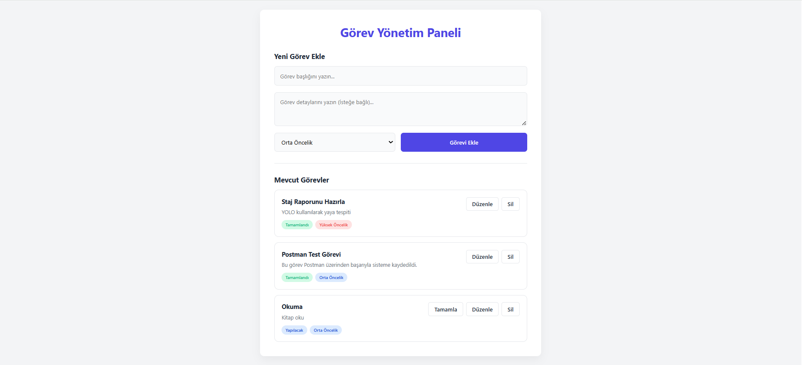
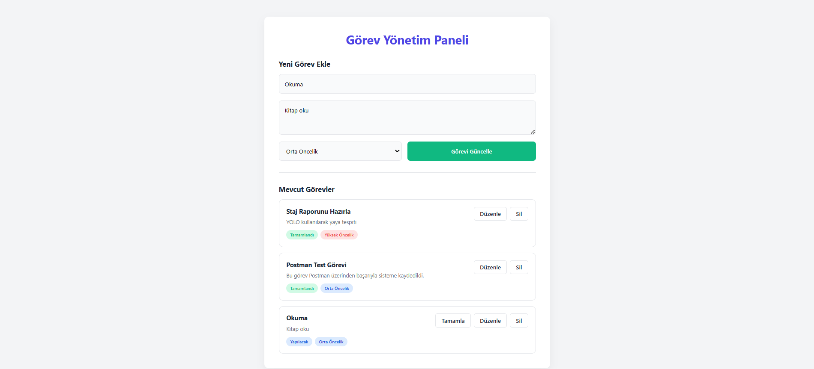

# 📝 Task Management System - Frontend

Bu proje, modern bir Görev Yönetim Sistemi'nin kullanıcı arayüzünü (UI) içermektedir. Saf (Vanilla) JavaScript, HTML5 ve CSS3 kullanılarak, hiçbir harici kütüphane veya framework (React, Vue vb.) bağımlılığı olmadan geliştirilmiştir.

Uygulama, arka planda çalışan C# .NET API'si ile Fetch API üzerinden haberleşerek tam kapsamlı CRUD (Oluşturma, Okuma, Güncelleme, Silme) operasyonlarını gerçekleştirir.

## ✨ Özellikler

* **Kapsamlı CRUD İşlemleri:** Görev ekleme, listeleme, güncelleme ve kalıcı olarak silme.
* **Dinamik Durum Yönetimi:** Görevleri tek tıkla "Tamamlandı" olarak işaretleyebilme.
* **Akıllı Form:** Aynı form üzerinden yeni görev ekleme, mevcut görevi düzenleme,dinamik arama/filtreleme yapılabilir ve Dashboard (İstatistik Panosu) bakılabilir.
* **Veri Güvenliği:** Backend'den (C#) gelen veri uyuşmazlıklarına karşı (String/Int/Null) tam korumalı veri temizleme mekanizmaları.
* **Modern Arayüz:** Kullanıcı dostu, yumuşak geçişli ve CSS değişkenleriyle tasarlanmış modern UI.

## 📸 Ekran Görüntüleri

*Aşağıdaki görseller uygulamanın canlı kullanımını göstermektedir:*

 

 

## 🛠️ Kullanılan Teknolojiler

* **HTML5** (Semantik yapı)
* **CSS3** (Flexbox, CSS Değişkenleri, Modern UI tasarımı)
* **Vanilla JavaScript** (ES6+, Async/Await, DOM Manipülasyonu)
* **Fetch API** (Asenkron HTTP İstekleri)

## 🚀 Kurulum ve Çalıştırma

Bu projeyi yerel ortamınızda çalıştırmak için aşağıdaki adımları izleyin:

1. Arka uç (Backend) projesi olan `TaskManagementAPI`'yi ayağa kaldırın ve `http://localhost:5072` adresinde çalıştığından emin olun.
2. API tarafında **CORS** izinlerinin açık olduğundan emin olun.
3. Bu projeyi bilgisayarınıza indirin.
4. Klasör içerisindeki `index.html` dosyasına çift tıklayarak tarayıcınızda açın. Herhangi bir ekstra sunucu kurulumuna gerek yoktur.

## 👨‍💻 Geliştirici

**Erkan Parlak**
